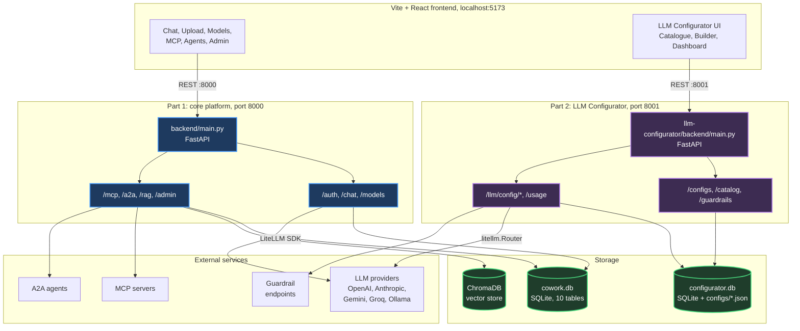
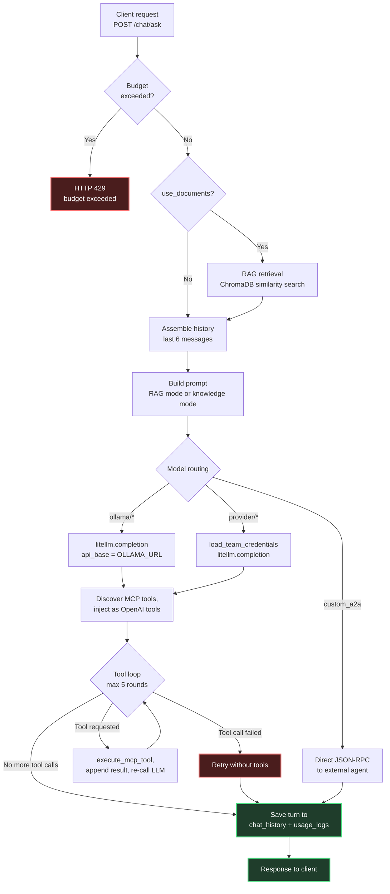
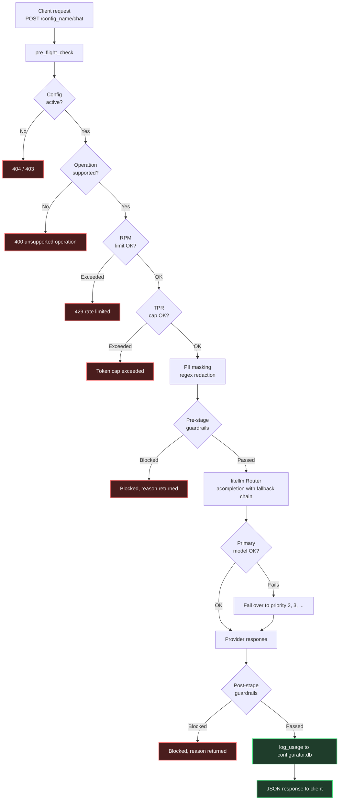
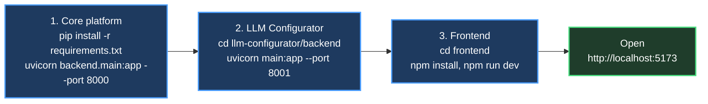

# AI Cowork

AI Cowork is a team AI workspace. It runs as two independent backends behind a single React frontend:

1. **Core platform** (port 8000). The team workspace itself: chat, document grounding with RAG, MCP tool calling, agent-to-agent calls, login, and per-team token budgets.
2. **LLM Configurator** (port 8001). A gateway for managing LLM access: fallback chains across models, guardrails, rate limits, and per-config usage analytics.

The two services share nothing but the frontend. They have separate entry points, separate dependency files, and separate databases, so either one can run without the other.

---

## Quick links

| Document | What it covers | Link |
|---|---|---|
| Core platform documentation | Architecture, RAG, MCP tool loop, A2A agents, auth, DB schema | [`DOCUMENTATION_CORE.md`](DOCUMENTATION_CORE.md) |
| LLM Configurator documentation | Gateway architecture, fallback chains, guardrails, analytics | [`llm-configurator/DOCUMENTATION.md`](llm-configurator/DOCUMENTATION.md) |
| LLM Configurator PDF | Same documentation as a PDF | [`llm-configurator/DOCUMENTATION.pdf`](llm-configurator/DOCUMENTATION.pdf) |
| Core platform requirements | Python dependencies for port 8000 | [`requirements.txt`](requirements.txt) |
| Configurator requirements | Python dependencies for port 8001 | [`llm-configurator/backend/requirements.txt`](llm-configurator/backend/requirements.txt) |

---

## System architecture



---

## What each service does

| | Part 1: core platform | Part 2: LLM Configurator |
|---|---|---|
| Port | `8000` | `8001` |
| Entry point | [`backend/main.py`](backend/main.py) | [`llm-configurator/backend/main.py`](llm-configurator/backend/main.py) |
| Handles | Chat workspace and history<br>Document RAG (ChromaDB + vector store)<br>MCP server integration<br>Agent-to-agent (A2A) calls<br>Team credit budgets and JWT auth | Multi-model fallback chains<br>TPM/RPM/TPR restrictions<br>Guardrails (PII masking, profanity)<br>Per-config analytics dashboard<br>Global LLM credentials catalogue |
| Requirements | [`requirements.txt`](requirements.txt) | [`llm-configurator/backend/requirements.txt`](llm-configurator/backend/requirements.txt) |
| Documentation | [`DOCUMENTATION_CORE.md`](DOCUMENTATION_CORE.md) | [`llm-configurator/DOCUMENTATION.md`](llm-configurator/DOCUMENTATION.md) |
| Database | `./data/cowork.db` (SQLite) plus ChromaDB | `./llm-configurator/backend/configurator.db` (SQLite) plus `configs/*.json` |

---

## How a chat request is handled

`POST /chat/ask` on the core platform:



## How a Configurator request is handled

`POST /{config_name}/chat` on the gateway:



---

## Requirements

There are two separate `requirements.txt` files, one per service. Install whichever service you are running.

**Core platform** ([`requirements.txt`](requirements.txt)) covers RAG (ChromaDB, SentenceTransformers), auth (bcrypt, JWT), and LiteLLM:

`fastapi`, `uvicorn`, `litellm`, `chromadb`, `sentence-transformers`, `pypdf`, `python-jose`, `passlib`, `cryptography`

**LLM Configurator** ([`llm-configurator/backend/requirements.txt`](llm-configurator/backend/requirements.txt)) is lighter, covering routing, validation, and usage logging only:

`fastapi`, `uvicorn`, `pydantic`, `litellm`, `python-dotenv`, `cryptography`

---

## Running it



### 1. Core platform backend

```bash
# from the workspace root
pip install -r requirements.txt
python -m uvicorn backend.main:app --port 8000 --reload
```

### 2. LLM Configurator backend

```bash
cd llm-configurator/backend
pip install -r requirements.txt
python -m uvicorn main:app --port 8001 --reload
```

To populate the Configurator dashboard with synthetic usage data, run this from `llm-configurator/backend`:

```bash
python scripts/seed_usage.py
```

### 3. Frontend

```bash
# from the workspace root
cd frontend
npm install
npm run dev
```

The frontend serves on port 5173 and talks to both backends.

---

## Comprehensive Documentation Links

* **Core Platform Documentation**: [`DOCUMENTATION_CORE.md`](DOCUMENTATION_CORE.md)
* **LLM Configurator Documentation**: [`llm-configurator/DOCUMENTATION.md`](llm-configurator/DOCUMENTATION.md)
* **LLM Configurator PDF Document**: [`llm-configurator/DOCUMENTATION.pdf`](llm-configurator/DOCUMENTATION.pdf)
