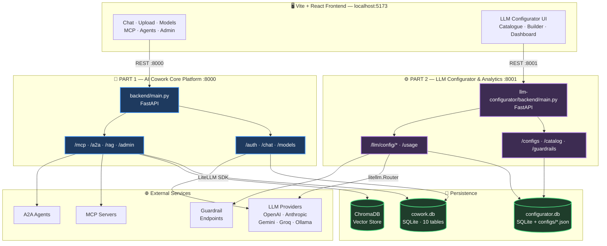
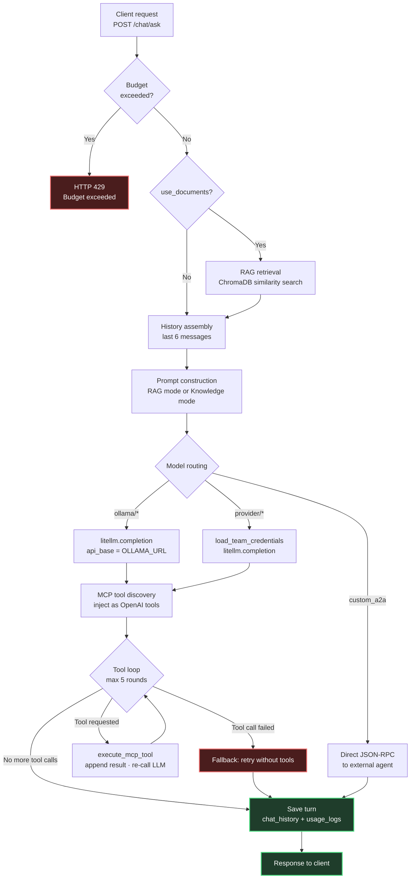
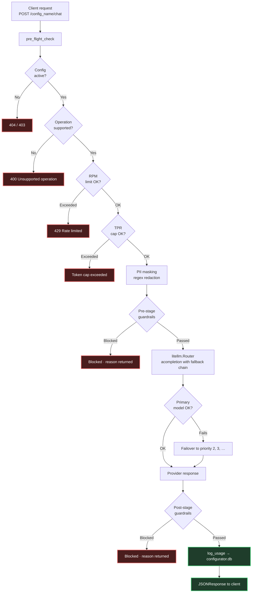
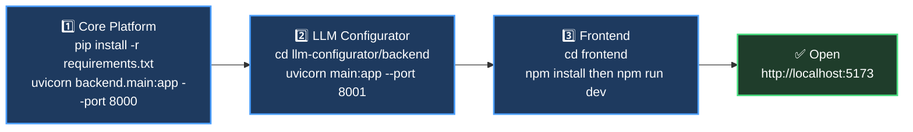

# 🚀 AI Cowork — Dual Architecture Workspace

**AI Cowork** is an enterprise-grade AI collaboration platform split into two decoupled micro-services sharing a unified React frontend:

1. **Part 1: Core AI Cowork Platform** (Port 8000) — Team workspace with RAG document grounding, Model Context Protocol (MCP) tools, Agent-to-Agent (A2A) orchestration, user authentication, and team credit budgets.
2. **Part 2: LLM Configurator & Analytics Engine** (Port 8001) — Enterprise LLM gateway manager supporting fallback chains, PII/profanity guardrails, sliding-window rate limits, and real-time per-config usage dashboards.

---

## 📚 Quick Links & Documentation

| Document | Description | Link |
|---|---|---|
| 📄 **Core Platform Documentation** | Full architecture, RAG, MCP tool loop, A2A agents, Auth & DB schema | [`DOCUMENTATION_CORE.md`](DOCUMENTATION_CORE.md) |
| 📄 **LLM Configurator Documentation** | Gateway architecture, fallback chains, guardrails & analytics dashboard | [`llm-configurator/DOCUMENTATION.md`](llm-configurator/DOCUMENTATION.md) |
| 📑 **LLM Configurator PDF Spec** | PDF documentation artifact | [`llm-configurator/DOCUMENTATION.pdf`](llm-configurator/DOCUMENTATION.pdf) |
| 📦 **Core Platform Requirements** | Python dependencies for Part 1 (Port 8000) | [`requirements.txt`](requirements.txt) |
| 📦 **Configurator Requirements** | Python dependencies for Part 2 (Port 8001) | [`llm-configurator/backend/requirements.txt`](llm-configurator/backend/requirements.txt) |

---

## 📊 System Architecture



---

## 🧭 Project Differentiation

The two services are fully decoupled — separate entry points, separate dependency files, separate databases.

| | 🧩 **Part 1 — Core Platform** | ⚙️ **Part 2 — LLM Configurator** |
|---|---|---|
| **Port** | `8000` | `8001` |
| **Entry Point** | [`backend/main.py`](backend/main.py) | [`llm-configurator/backend/main.py`](llm-configurator/backend/main.py) |
| **Capabilities** | Chat workspace & history<br>Document RAG (ChromaDB + vector store)<br>MCP server protocol integration<br>Agent-to-Agent (A2A) framework<br>Team credit budgets & Auth (JWT) | Dynamic multi-model fallback chains<br>Enterprise restrictions (TPM/RPM/TPR)<br>Guardrails (PII masking, profanity)<br>Per-config analytics dashboard<br>Global LLM credentials catalogue |
| **Requirements** | [`requirements.txt`](requirements.txt) | [`llm-configurator/backend/requirements.txt`](llm-configurator/backend/requirements.txt) |
| **Documentation** | [`DOCUMENTATION_CORE.md`](DOCUMENTATION_CORE.md) | [`llm-configurator/DOCUMENTATION.md`](llm-configurator/DOCUMENTATION.md) |
| **Database** | `./data/cowork.db` (SQLite) + ChromaDB | `./llm-configurator/backend/configurator.db` (SQLite) + `configs/*.json` |

---

## 🔄 Core Platform — `POST /chat/ask` Execution Flow



---

## 🛡️ LLM Configurator — Request Pipeline



---

## 📋 Requirements & Dependencies

The project maintains **two independent `requirements.txt` files** tailored to each service:

### 1️⃣ Core Platform Requirements (`requirements.txt`)
Contains full dependencies for RAG (ChromaDB, SentenceTransformers), Auth (Bcrypt, JWT), and LiteLLM integration.

* 🔗 **File Link**: [`requirements.txt`](requirements.txt)
* **Key Dependencies**: `fastapi`, `uvicorn`, `litellm`, `chromadb`, `sentence-transformers`, `pypdf`, `python-jose`, `passlib`, `cryptography`

### 2️⃣ LLM Configurator Requirements (`llm-configurator/backend/requirements.txt`)
Contains lightweight dependencies focused strictly on high-performance LLM routing, validation, and execution analytics.

* 🔗 **File Link**: [`llm-configurator/backend/requirements.txt`](llm-configurator/backend/requirements.txt)
* **Key Dependencies**: `fastapi`, `uvicorn`, `pydantic`, `litellm`, `python-dotenv`, `cryptography`

---

## 🛠️ Quick Start Guide



### Step 1: Install & Run Part 1 (Core Platform Backend)

```bash
# From workspace root
pip install -r requirements.txt

# Start Core Platform Backend (Port 8000)
python -m uvicorn backend.main:app --port 8000 --reload
```

### Step 2: Install & Run Part 2 (LLM Configurator Backend)

```bash
# Navigate to configurator backend
cd llm-configurator/backend

# Install configurator dependencies
pip install -r requirements.txt

# Start Configurator Backend (Port 8001)
python -m uvicorn main:app --port 8001 --reload
```

*(Optional: Seed synthetic usage data for the Configurator Dashboard — run from `llm-configurator/backend`)*
```bash
python scripts/seed_usage.py
```

### Step 3: Run the React Frontend

```bash
# From workspace root
cd frontend

# Install node dependencies
npm install

# Start Vite dev server (Port 5173)
npm run dev
```

---

## 📖 Comprehensive Documentation Links

* 📄 **Core Platform Documentation**: [`DOCUMENTATION_CORE.md`](DOCUMENTATION_CORE.md)
* 📄 **LLM Configurator Documentation**: [`llm-configurator/DOCUMENTATION.md`](llm-configurator/DOCUMENTATION.md)
* 📑 **LLM Configurator PDF Document**: [`llm-configurator/DOCUMENTATION.pdf`](llm-configurator/DOCUMENTATION.pdf)
