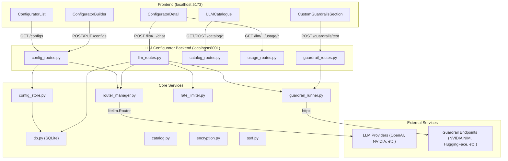
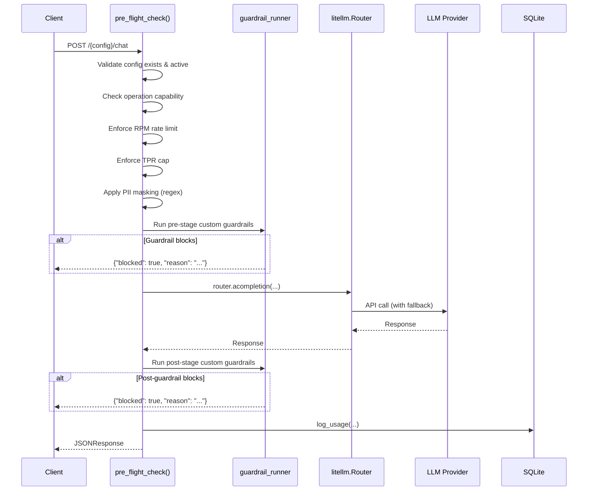

# AI Cowork LLM Configurator Documentation

## Table of Contents

1. [Overview](#1-overview)
2. [Architecture](#2-architecture)
3. [LLM Catalogue](#3-llm-catalogue)
4. [LLM Configurator](#4-llm-configurator)
5. [Dashboard & Analytics](#5-dashboard--analytics)
6. [Custom Guardrails](#6-custom-guardrails)
7. [Error Management](#7-error-management)
8. [API Reference](#8-api-reference)

---

## 1. Overview

The **LLM Configurator** is a self-contained microservice within the AI Cowork platform that lets users create, manage, and monitor LLM configurations. Each configuration bundles together:

- **Model fallback chains**: ordered lists of LLM models per operation type (chat, completion, embedding, etc.) with automatic failover.
- **Rate limits & restrictions**: TPM (Tokens Per Minute), RPM (Requests Per Minute), and TPR (Tokens Per Request) caps.
- **Guardrails**: built-in PII masking plus user-defined custom guardrails (HTTP webhooks, HuggingFace classifiers, or OpenAI-compatible safety models).
- **Custom operations**: user-defined prompt-wrapped endpoints with their own model chains.

Once saved, each configuration exposes a set of REST endpoints (e.g., `/{config_name}/chat`, `/{config_name}/embeddings`) that downstream agents and applications can call. The Configurator handles routing, failover, rate limiting, guardrail enforcement, and usage logging transparently.

### Technology Stack

| Layer | Technology |
|-------|-----------|
| Backend Framework | FastAPI (Python, async) |
| LLM Routing | LiteLLM Router SDK (`litellm.Router`) |
| Database | SQLite (`configurator.db`) |
| Config Persistence | JSON files (`configs/*.json`) + SQLite metadata |
| Frontend | React + Vite, Recharts for analytics |
| HTTP Client (guardrails) | `httpx` (async) |
| Encryption | Fernet symmetric encryption |

### Ports

| Service | Port | Purpose |
|---------|------|---------|
| Frontend (Vite) | 5173 | React development server |
| Main Backend | 8000 | AI Cowork core (auth, chat, agents, RAG) |
| LLM Configurator | 8001 | Configuration CRUD, LLM proxy, analytics |

---

## 2. Architecture

### System Diagram



### Data Flow: LLM Call



### Dual Storage Model

Configurations use a **dual-storage** pattern:

1. **JSON files** (`configs/{full_name}.json`): the source of truth for configuration data (operations, restrictions, guardrails).
2. **SQLite table** (`llm_configs`): stores metadata (status, timestamps) and enables fast listing/querying.

On startup, the system globs all JSON files, loads them, and builds a `litellm.Router` instance for each active config.

---

## 3. LLM Catalogue

### What It Does

The LLM Catalogue is the **prerequisite step** before building a configuration. It provides:

1. **Model Discovery**: Browses all models known to LiteLLM (from `litellm.model_cost`) grouped by provider.
2. **Model Configuration**: Lets users supply API keys and custom base URLs for models they want to use.
3. **Custom Model Registration**: Supports adding arbitrary models not in LiteLLM's built-in catalogue.

### Implementation

#### Backend

| File | Purpose |
|------|---------|
| [catalog.py](backend/catalog.py) | Core catalogue logic |
| [catalog_routes.py](backend/routes/catalog_routes.py) | REST endpoints |

**`get_models_catalog()`** iterates through `litellm.model_cost` (a built-in dictionary of ~thousands of models) and extracts:
- `provider`: parsed from the model key prefix (e.g., `openai/` → OpenAI)
- `mode`: chat, completion, embedding, image_generation, audio_transcription, audio_speech
- `max_tokens`, `max_output_tokens`: token limits
- `supports_vision`: boolean

The function supports filtering by `provider`, `mode`, and free-text `query`.

**`OPERATIONS_SPEC`** defines the 7 supported operation types with their endpoint paths, request shapes, and corresponding LiteLLM functions:

| Operation | Endpoint Path | LiteLLM Function | Derived |
|-----------|--------------|-------------------|---------|
| chat | `/{name}/chat` | `acompletion` | No |
| vision | `/{name}/vision` | `acompletion` | Yes (uses chat models) |
| completion | `/{name}/completions` | `atext_completion` | No |
| embedding | `/{name}/embeddings` | `aembedding` | No |
| image_generation | `/{name}/images/generations` | `aimage_generation` | No |
| audio_transcription | `/{name}/audio/transcriptions` | `atranscription` | No |
| audio_speech | `/{name}/audio/speech` | `aspeech` | No |

**Global Models** are stored in the `global_models` SQLite table. When a user "configures" a model, their API key and base URL are saved here. These credentials are later resolved by `router_manager.py` when building LiteLLM Router instances.

#### Frontend

[LLMCatalogue.jsx](../frontend/src/pages/LLMConfigurator/LLMCatalogue.jsx) renders a two-level interface:

1. **Provider Grid**: Cards showing provider name, total model count, and count of user-configured models.
2. **Provider Detail**: Clicking a provider drills into its model list. Each model shows its name, mode, and a "Configure" or "Edit" button.
3. **Configure Modal**: Form fields for API Key (password) and API Base URL (text).
4. **Add Custom Model Modal**: For models not in LiteLLM's catalogue. Requires a model name containing `/` (e.g., `custom/my-model`), plus optional API key and base URL.

#### Error Handling

| Error | Display |
|-------|---------|
| Failed to load catalogue | Top banner: "Failed to load catalogue data" |
| Failed to save model config | Top banner: "Failed to save configuration" |
| Custom model name missing `/` | Inline red validation message |
| Failed to add custom model | Top banner with error detail |

---

## 4. LLM Configurator

### What It Does

The Configurator is the **core builder** where users create LLM configurations. Each configuration defines:

- **Identity**: `usecase_name` + `config_name` → produces a `full_name` (e.g., `my_usecase_my_config`)
- **Operations with Fallback Chains**: For each operation type, an ordered list of models with priorities (1 = primary, 2+ = fallback)
- **Custom Operations**: User-defined operations with a system prompt/description and their own model chains (up to 10)
- **Restrictions**: TPM, RPM (auto-calculated from TPM ÷ TPR), and TPR (auto-calculated as min `max_output_tokens` across all selected models)
- **Guardrails**: Built-in PII masking + custom guardrails (see [Section 6](#6-custom-guardrails))

### Implementation

#### Backend

| File | Purpose |
|------|---------|
| [schemas.py](backend/schemas.py) | Pydantic validation models |
| [config_store.py](backend/config_store.py) | CRUD persistence |
| [config_routes.py](backend/routes/config_routes.py) | REST endpoints |
| [router_manager.py](backend/router_manager.py) | LiteLLM Router lifecycle |
| [llm_routes.py](backend/routes/llm_routes.py) | LLM call execution |
| [rate_limiter.py](backend/rate_limiter.py) | In-memory sliding window RPM enforcement |

##### Schema Validation (`schemas.py`)

The `ConfigRequest` model enforces strict validation via a Pydantic `model_validator`:

- `chat` operation is **required** and must be non-empty
- `vision` is rejected as a standalone operation (it's a capability of chat models)
- Each operation must use only models whose `mode` matches (e.g., embedding models can't be in the chat chain)
- Priorities must be contiguous starting from 1 (e.g., `[1, 2, 3]`, not `[1, 3]`)
- Custom operations: max 10, names must match `^[a-zA-Z0-9_-]+$`, names cannot collide with reserved segments (`chat`, `completions`, `usage`, `capabilities`, etc.)
- Custom operation models must be chat-mode models

##### Config Persistence (`config_store.py`)

```
create_config(req) → generates full_name → checks DB uniqueness → writes JSON → inserts DB row
update_config(name, req) → validates name match → checks DB exists → overwrites JSON → updates DB
get_config(name) → reads JSON + DB status → returns ConfigResponse
delete_config(name) → deletes DB row + JSON file
```

Custom exceptions:
- `ConfigAlreadyExistsError`: raised on duplicate `full_name` (→ HTTP 409)
- `ConfigNotFoundError`: raised when config doesn't exist (→ HTTP 404)

##### Router Management (`router_manager.py`)

When a config is created or updated, `build_router_for_config()`:

1. Fetches all global models from DB (to resolve API keys/bases)
2. Builds a `model_list` for LiteLLM with entries like:
   ```python
   {
       "model_name": "{full_name}::chat",
       "litellm_params": {"model": "gpt-4o", "api_key": "sk-...", "api_base": "..."},
       "tpm": 100000,
       "rpm": 60,
       "order": 1  # priority
   }
   ```
3. Creates a `litellm.Router` with:
   - `routing_strategy = "usage-based-routing-v2"`
   - `num_retries = 2`
   - `timeout = 120`
   - `enable_pre_call_checks = True`

On startup (`load_all_configs_on_startup`), all JSON configs are loaded and routers are built for active configs.

##### LLM Call Execution (`llm_routes.py`)

Every LLM call goes through a pipeline:

```
pre_flight_check() → router.acompletion() → execute_router_call()
```

**`pre_flight_check()`** performs 5 checks in order:
1. Config exists and is `active` (404 if not)
2. Operation is supported by the config (400 if not)
3. RPM rate limit not exceeded (429 if exceeded)
4. `max_tokens` within TPR cap (400 if exceeded, auto-set if missing)
5. PII masking applied (regex for emails and phone numbers)
6. Pre-stage custom guardrails run (blocks or redacts input)

**`execute_router_call()`** handles the response:
1. Awaits the LiteLLM coroutine
2. Runs post-stage custom guardrails on output text (non-streaming only)
3. Extracts: model used, token usage, cost (via `litellm.completion_cost()`), finish reason, fallback detection
4. Logs everything to `usage_logs` table
5. Returns JSON response

##### Rate Limiting (`rate_limiter.py`)

Uses an **in-memory sliding window** (60-second window). Each config gets its own rate counter keyed by `full_name`. When the window fills to the RPM limit, subsequent requests get a **429** response.

#### Frontend

[ConfiguratorBuilder.jsx](../frontend/src/pages/LLMConfigurator/ConfiguratorBuilder.jsx) is a large form component (~800 lines) with these sections:

1. **Identity**: `usecaseName` + `configName` inputs. A live preview shows the generated `full_name` and base endpoint URL. Fields are disabled when editing.

2. **Operations Fallback Chains**. Dual-pane layout per operation type:
   - **Left**: Ordered "Routing Chain" showing selected models with drag-up/down priority reordering, per-model TPM input, and auto-calculated RPM
   - **Right**: Searchable catalogue picker grouped by provider, with add/already-added indicators

3. **Custom Operations**: Expandable sections with description/system-prompt textarea and model chain picker (limited to chat models)

4. **Overall Restrictions**: TPM slider (100 → 10M) with numeric input. Auto-calculated RPM and TPR displayed as read-only cards with formula explanations.

5. **Guardrails**: PII Masking toggle (active), Profanity Filter (disabled/coming soon), plus embedded `CustomGuardrailsSection`.

6. **Footer**: Cancel and Save buttons. Save disabled until required fields are filled.

[ConfiguratorList.jsx](../frontend/src/pages/LLMConfigurator/ConfiguratorList.jsx) renders the list view with a table of all configs, status badges, and action buttons (View/Edit/Delete with confirmation modal).

#### Error Handling

| Scenario | HTTP Code | Frontend Display |
|----------|-----------|-----------------|
| Duplicate config name | 409 | Banner: "config name already taken" |
| Validation errors (bad priorities, invalid model, etc.) | 400/422 | Banner: extracted `detail` array or string |
| Config not found | 404 | Full-page error with "Go Back" button |
| Save failure | 500 | Banner: "Failed to save configuration" |

---

## 5. Dashboard & Analytics

### What It Does

The Dashboard provides **real-time analytics** for each configuration:
- KPI summary cards with period-over-period comparison
- Time-series charts for requests, tokens, cost, and latency
- Per-model and per-operation breakdowns
- Recent log browsing
- Inline endpoint testing

### Implementation

#### Backend

[usage_routes.py](backend/routes/usage_routes.py) provides 5 analytics endpoints, all querying the `usage_logs` SQLite table:

##### `GET /{config}/usage/summary`

Returns current and previous period stats for comparison:

| Metric | Description |
|--------|-------------|
| `total_calls` | Count of all requests |
| `success_rate` | Percentage of successful calls |
| `prompt_tokens` | Sum of prompt tokens |
| `completion_tokens` | Sum of completion tokens |
| `total_tokens` | Sum of all tokens |
| `total_cost` | Sum of cost (USD) |
| `p95_latency_ms` | 95th percentile latency |
| `fallback_triggers` | Count of calls that hit fallback models |

The "previous period" covers the same duration immediately before the current period, enabling delta badges (e.g., "+12% vs last 7d").

##### `GET /{config}/usage/timeseries`

Returns bucketed time-series data (1-hour buckets for 24h range, 1-day buckets otherwise). Each bucket contains:
- `total_calls`, `success_calls`, `failed_calls`
- `prompt_tokens`, `completion_tokens`, `total_tokens`
- `total_cost`
- `avg_latency_ms`, `p95_latency_ms`
- `peak_tpm`: peak tokens-per-minute within the bucket (computed via minute-level sub-aggregation)
- `peak_rpm`: peak requests-per-minute within the bucket

Also returns `config_limits: { tpm_limit, rpm_limit }` for chart reference lines.

##### `GET /{config}/usage/by-model`

Groups by `model_used`. Returns per-model: calls, success/failed counts, tokens, cost, fallback count, and `share_percentage`. Includes a synthetic `(all models failed)` entry for requests where `model_used` is null.

##### `GET /{config}/usage/by-operation`

Groups by `endpoint`. Returns per-operation: calls, total_tokens, cost.

##### `GET /{config}/logs/recent`

Returns the last N (1 to 200, default 50) log entries with full detail: timestamp, operation, model, tokens, cost, latency, success, error, fallback status.

#### Frontend

[ConfiguratorDetail.jsx](../frontend/src/pages/LLMConfigurator/ConfiguratorDetail.jsx) (~830 lines) renders a comprehensive dashboard:

##### KPI Row (6 cards)
| Card | Source Field | Delta |
|------|-------------|-------|
| Total Calls | `summary.total_calls` | vs previous period |
| Total Tokens | `summary.total_tokens` | vs previous period |
| Total Cost | `summary.total_cost` | vs previous period |
| Success Rate | `summary.success_rate` | vs previous period |
| p95 Latency | `summary.p95_latency_ms` | vs previous period |
| Fallback Triggers | `summary.fallback_triggers` | vs previous period |

##### Charts (6 Recharts visualizations)
1. **Requests Over Time**: BarChart (success + failed stacked)
2. **Tokens Over Time**: AreaChart (prompt + completion stacked)
3. **Cost Over Time**: AreaChart
4. **Latency Over Time**: LineChart (average + p95)
5. **Token Throughput**: BarChart with TPM limit reference line
6. **Request Rate**: BarChart with RPM limit reference line

##### Additional Panels
- **Per-Model Breakdown**: Table with calls, tokens, cost, share %, fallbacks
- **Cost by Model**: List of models with costs
- **By Operation**: Progress bars showing call distribution
- **Endpoints & Capabilities**: Lists all available URLs with copy-to-clipboard
- **Operations Chain**: Read-only display of fallback chains
- **Test Endpoint**: Inline form (operation selector + text input + response panel)
- **Restrictions & Guardrails**: Sidebar showing RPM/TPM/TPR and guardrail status
- **Recent Logs**: Table of last 50 entries

##### Features
- **Time Range Selector**: 24h / 7d / 30d / All
- **Model Filter**: Filter dashboard by specific model
- **Auto-Refresh**: Dashboard data refreshes every 30 seconds
- **Inline Testing**: Test any operation (including custom operations) directly from the dashboard

#### Error Handling

| Scenario | Display |
|----------|---------|
| Config not found on load | Full-page error: warning icon + "Go Back" button |
| Provider error on test | Inline red panel: "Provider failure" |
| Rate limit on test | Inline panel: "Rate Limit" |
| Test errors | Inline panel with `detail` extraction |
| Dashboard data fetch failure | Silently logged to console (charts show empty) |
| Delete failure | Top banner with error message |

---

## 6. Custom Guardrails

### What It Does

Custom Guardrails let users attach their own safety/moderation endpoints to any configuration. Guardrails run on every LLM call and can **block**, **redact**, **warn**, or **log** based on the external endpoint's verdict.

### Three Adapter Types

| Adapter | Payload Format | Response Parsing | Use Case |
|---------|---------------|------------------|----------|
| `http_generic` | `{"text": "...", "role": "input/output", "context": {...}}` | Reads `allowed`, `modified_text`, `reason` from JSON | Custom guardrail APIs |
| `huggingface_inference` | `{"inputs": "..."}` | Checks for `"toxic"` label with score > 0.5 | HuggingFace text classifiers |
| `openai_chat_safety` | OpenAI chat completions format with optional system prompt | Parses `safe/unsafe` verdicts from text content | NVIDIA Nemotron, Llama Guard, any OpenAI-compatible safety model |

### Safety Verdict Parser (`openai_chat_safety`)

The parser handles multiple verdict formats case-insensitively:

| Pattern | Example | Result |
|---------|---------|--------|
| `User/Response Safety: safe\|unsafe` | `"User Safety: unsafe"` | unsafe |
| `Prompt harm: harmful\|unharmful` | `"Prompt harm: harmful"` | unsafe |
| Bare leading token | `"safe"` or `"unsafe\nDetails..."` | as stated |
| `Safety Categories: a, b, c` | `"Safety Categories: violence, hate"` | extracted into categories array |

> [!IMPORTANT]
> **Unparseable verdicts are NEVER silently allowed.** If no known pattern matches, the guardrail is treated as an error and the `fail_mode` (fail_open or fail_closed) is applied.

### Circuit Breaker

Each guardrail has an in-memory circuit breaker:
- **Threshold**: 5 consecutive failures
- **Cooldown**: 60 seconds
- When tripped, the guardrail is bypassed and `fail_mode` is applied (block if `fail_closed`, skip if `fail_open`)
- Resets on first successful call after cooldown

### SSRF Protection

All guardrail URLs are validated at **save time** and at **call time**:
- Only `http://` and `https://` schemes allowed
- Cloud metadata IP (`169.254.169.254`) is **always blocked**
- Private/loopback/link-local IPs are blocked unless `allow_local = true`
- DNS resolution is performed to detect hostname-based SSRF

### Encryption

Guardrail auth tokens (`secret_ciphertext`) are encrypted at rest using **Fernet symmetric encryption**. The encryption key is loaded from the root `.env` file (`ENCRYPTION_KEY`). Tokens are:
- Encrypted on config save (if not already encrypted)
- Decrypted at call time before being sent as `Authorization: Bearer <token>`
- Never exposed in GET responses or log lines

### Frontend (Source Presets)

When selecting `openai_chat_safety`, the UI shows a **Source Preset** selector:

| Preset | Pre-filled URL | Key Placeholder | Model Required |
|--------|---------------|-----------------|----------------|
| NVIDIA | `https://integrate.api.nvidia.com/v1/chat/completions` | `nvapi-...` | Yes |
| HuggingFace | (empty, user pastes) | `hf_...` | No |
| Local (Ollama/vLLM) | `http://localhost:11434/v1/chat/completions` | `(optional)` | Yes |
| Other | (empty) | `Bearer token (optional)` | No |

The mandatory **Test-before-save** flow requires a successful test (or explicit force-save override) before a guardrail can be saved. On parse failures, the raw model text is surfaced to help debugging.

---

## 7. Error Management

### Error Classification

The system classifies LLM provider errors into 5 categories via `classify_error()`:

| Category | Detection | HTTP Code |
|----------|-----------|-----------|
| `rate_limit` | "rate" + "limit" in error message, or status 429 | 429 |
| `connection_error` | "connection" in message | 502 |
| `auth_error` | "auth" or "permission" or "key" in message, or status 401/403 | 502 |
| `timeout` | "timeout" in message | 502 |
| `not_found` | "not found" in message, or status 404 | 502 |
| `provider_error` | Default fallback | 502 |

### HTTP Error Codes Summary

| Code | Source | Meaning |
|------|--------|---------|
| **200** | `main.py` exception handler | Guardrail block (structured refusal: `{"blocked": true, "reason": "..."}`) |
| **201** | `config_routes` | Config created successfully |
| **204** | `config_routes` | Config deleted successfully |
| **400** | `config_routes`, `llm_routes`, `guardrail_routes` | Validation error (bad schema, SSRF fail, TPR exceeded, model mode mismatch) |
| **404** | `config_routes`, `llm_routes` | Config/operation/custom-op not found |
| **409** | `config_routes` | Duplicate config name |
| **429** | `llm_routes` | RPM rate limit exceeded |
| **502** | `llm_routes`, `guardrail_routes` | Provider error or guardrail endpoint failure |
| **504** | `guardrail_routes` | Guardrail endpoint timeout |

### Frontend Error Display Patterns

The frontend uses **three patterns** for displaying errors:

#### 1. Animated Top Banner
Used by: `ConfiguratorList`, `ConfiguratorBuilder`, `LLMCatalogue`

A colored banner at the top of the page (green for success, red for error) with:
- Error text extracted from `err.response?.data?.detail` or a generic fallback
- Dismissable with an X button
- Slides in with animation

#### 2. Full-Page Error State
Used by: `ConfiguratorDetail` (when config cannot be loaded)

A centered warning icon with the error message and a "Go Back" button. Replaces the entire page content.

#### 3. Inline Panel
Used by: `ConfiguratorDetail` (test endpoint), `CustomGuardrailsSection` (guardrail test)

A colored panel within the current view showing:
- Success: green panel with response details (latency, allowed/blocked, model used)
- Error: red panel with specific error messaging (e.g., "Provider failure" for 502, "Rate Limit" for 429)
- Parse error (guardrails): red panel with raw model text + expandable raw JSON response

### Guardrail Error Management

| Failure Type | Logged Decision | Behavior |
|-------------|----------------|----------|
| SSRF validation failure | `error (ssrf_blocked, {fail_mode})` | Applies fail_mode |
| HTTP timeout | `timeout ({fail_mode})` | Increments circuit breaker, applies fail_mode |
| HTTP error | `error ({fail_mode})` | Increments circuit breaker, applies fail_mode |
| Circuit breaker open | `error (circuit_breaker_open, {fail_mode})` | Applies fail_mode without making a request |
| Unparseable response (openai_chat_safety) | `error (unparseable_response, {fail_mode})` | Applies fail_mode, never silently allows |
| Unknown verdict format (openai_chat_safety) | `error (unknown_verdict_format, {fail_mode})` | Applies fail_mode, never silently allows |

All decisions are logged to the `guardrail_events` table with: config name, guardrail name, stage, decision, and latency.

### Fallback Detection

The system detects when a fallback model was used instead of the primary. `was_fallback_triggered()` compares the actual `model_used` (from the LiteLLM response) against the priority-1 model configured for that operation. This is logged in `usage_logs.fallback_triggered` and surfaced in the dashboard.

---

## 8. API Reference

### Config Management (`/configs`)

| Method | Path | Description | Success | Errors |
|--------|------|-------------|---------|--------|
| `GET` | `/configs` | List all configurations | 200 | none |
| `POST` | `/configs` | Create a new configuration | 201 | 400, 409 |
| `GET` | `/configs/{full_name}` | Get configuration details | 200 | 404 |
| `PUT` | `/configs/{full_name}` | Update a configuration | 200 | 400, 404 |
| `DELETE` | `/configs/{full_name}` | Delete a configuration | 204 | 404 |

### LLM Endpoints (`/llm/{full_name}`)

| Method | Path | Description | Errors |
|--------|------|-------------|--------|
| `POST` | `/llm/{name}/chat` | Chat completion | 400, 404, 429, 502 |
| `POST` | `/llm/{name}/vision` | Vision (multimodal chat) | 400, 404, 429, 502 |
| `POST` | `/llm/{name}/completions` | Text completion | 400, 404, 429, 502 |
| `POST` | `/llm/{name}/embeddings` | Generate embeddings | 400, 404, 429, 502 |
| `POST` | `/llm/{name}/images/generations` | Generate images | 400, 404, 429, 502 |
| `POST` | `/llm/{name}/audio/transcriptions` | Transcribe audio | 400, 404, 429, 502 |
| `POST` | `/llm/{name}/audio/speech` | Text to speech | 400, 404, 429, 502 |
| `POST` | `/llm/{name}/{custom_op}` | Custom operation | 400, 404, 429, 502 |
| `GET` | `/llm/{name}/capabilities` | List capabilities | 404 |
| `GET` | `/llm/{name}/usage` | Basic usage stats | 404 |

### Catalogue (`/catalog`)

| Method | Path | Description |
|--------|------|-------------|
| `GET` | `/catalog/models` | Browse LiteLLM model catalogue (filter by provider, mode, query) |
| `GET` | `/catalog/operations` | List supported operation types |
| `GET` | `/catalog/global_models` | List user-configured models |
| `POST` | `/catalog/global_models` | Configure/add a model (upsert) |
| `DELETE` | `/catalog/global_models/{model}` | Remove a configured model |

### Analytics (`/llm/{config_name}`)

| Method | Path | Query Params | Description |
|--------|------|-------------|-------------|
| `GET` | `/llm/{name}/usage/summary` | `range` (24h/7d/30d/all), `model` | KPI summary with period comparison |
| `GET` | `/llm/{name}/usage/timeseries` | `range`, `bucket` (1h/1d), `model` | Time-series chart data |
| `GET` | `/llm/{name}/usage/by-model` | `range` | Per-model breakdown |
| `GET` | `/llm/{name}/usage/by-operation` | `range` | Per-operation breakdown |
| `GET` | `/llm/{name}/logs/recent` | `limit` (1-200) | Recent log entries |

### Guardrails (`/guardrails`)

| Method | Path | Description | Errors |
|--------|------|-------------|--------|
| `POST` | `/guardrails/test` | Test a guardrail endpoint | 400, 502, 504 |

### Database Tables

| Table | Database | Purpose |
|-------|----------|---------|
| `llm_configs` | `configurator.db` | Config metadata (status, timestamps) |
| `usage_logs` | `configurator.db` | Per-call usage logging (tokens, cost, latency, errors) |
| `global_models` | `configurator.db` | User-configured model credentials |
| `guardrail_events` | `configurator.db` | Guardrail decision audit log |
